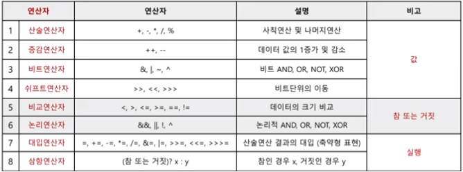
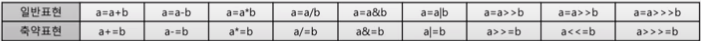

# 연산자

연산자 종류는 8개로 이루어져 있다.

<br>

   
-연산자 종류

<br>

1번부터 4번까지의 연산자의 결과로는 값이 반환된다.

5번부터 6번까지의 연산자의 결과로는 true 또는 false의 논리값이 반환된다.

7번부터 8번까지의 연산자의 결과로는 특정 변수에 연산결과의 값을 대입된다.

<br>

## 산술연산자

<br>

산술연산자는 +, -, *, /, % 로 이루어져 있고 해당 연산자를 사용했을때 결과는 다음과 같다.

<br>

```
System.out.println(2+3);   // 5
System.out.println(8-5);   // 3
System.out.println(7*2);   // 14
System.out.println(7/2);   // 3
System.out.println(8%5);   // 3
```

<br>

## 증감연산자

<br>

증감연산자는 ++, -- 로 이루어져 있으며 증감연산자가 변수명의 어느 위치에 있는지에 따라 동작이 달라진다.

변수명 앞에 증감연산자가 붙은경우 전위형이라고 하며 연산전 증감을 수행한다.

변수명 뒤에 증감연산자가 붙은경우 후위형이라고 하며 연산후 증감을 수행한다.

<br>

```
int a = 3;
int b = ++a;
System.out.println(a);  // 4
System.out.println(b);  // 4

int a = 3;
int b = a++;
System.out.println(a);  // 4
System.out.println(b);  // 3
```

<br>

## 비트연산자

비트연산자는 &, |, ~, ^ 로 이루어져 있으며 값을 이진수연산을 수행하는 연산자이다.

'&'는 두 값이 모두 1일 때 1을 반환하며 and 조건과 같다.

'|'는 두 값이 하나라도 1이 있다면 1을 반환하며 or 조건과 같다.

'^'는 두 값이 서로 다른 값을 가지고 있다면 1을 반환한다.

'~'는 값이 0이라면 1로, 1이라면 0으로 바꾼다.

<br>

비트값 읽는 방법은 양수일 경우와 음수일 경우 가 다르다.

비트값의 첫번째 비트는 부호에 대한 정보를 담는 비트라 하여 부호비트라고 한다. 부호비트가 0이면 양수, 1이면 음수라는 뜻을 가진다.

특정 비트가 양수라면 1을 기준으로 값을 읽고, 음수라면 0을 기준으로 값을 읽고 1을 더해준다.

<br>

## 쉬프트연산자

<br>

쉬프트연산자는 <<, >>, >>> 등으로 이루어져 있으며 비트의 위치를 변경하는 연산자이다.

부호의 위치에 따라 '<<'는 특정 비트의 위치를 왼쪽으로  이동하며 '>>'의 경우 오른쪽으로 이동한다. 비트이동시 부호비트값은 유지된다.

또한 한칸 왼쪽으로 이동할 경우 이동전 비트의 값보다 2배값이 되고 반대로 오른쪽으로 이동할 경우 이동전 비트의 값보다 1/2배값이 된다.

꺽새가 3개일경우 논리쉬프트연산자라고 하며 부호비트와 상관없이 비트값을 방향에 맞게 이동시칸다. 

<br>

## 비교연산자

<br>

비교연산자는 >, <, >=, <=, ==, != 등으로 이루어져 있으며 두 값의 크기를 비교하여 true와 false를 반환한다.

<br>

```
//크기비교
System.out.println(5<2>);   // false
System.out.println(5>2>);   // true
System.out.println(5>5>);   // false
System.out.println(5<=5>);   // true
System.out.println(5>=5>);   // true

//등가비교
System.out.println(5==2>);   // false
System.out.println(5!=2>);   // true
System.out.println(5==5>);   // true
System.out.println(5!=5>);   // false
```

<br>

등가비교는 stack메모리에 저장된 값을 가지고 비교를 하기 때문에 참조자료형일 경우 값이 같다 하더라도 false가 반환된다. 그이유는 참조자료형일 경우 stack에는 heap영역의 주소를 담고있기 때문이다.

<br>

```
int a = 3, b = 3;
System.out.println(a==b);   // true

String a = new String("안녕");
String b = new String("안녕");
System.out.println(a==b);   // false
```

<br>

또한 등가비교(==)와 대입연산자(=)는 반드시 구분해야한다.

```
int a = 3;
System.out.println(a==5);   // false
System.out.println(a=5);    // 5
```

<br>

## 논리연산자

<br>

논리연산자는 &&, ||, !, ^ 등으로 이루어져 있으며 비트연산자와 비슷한 동작을 한다. '&&'는 두 논리값을 비교하여 두 값 모두 true 일때 true를 반환하고, '||'는 두 논리값중 하나라도 true 일때 true 를 반환하고, '^'는 두 논리값이 다르다면 true 를 반환하고, '!'는 논리값을 뒤집는다.

<br>

```
// and
System.out.println(true && true);    // true
System.out.println(true && false);   // false
System.out.println(false && 5<3);    // false
System.out.println(5>=5 && 7>2);     // true

// or
System.out.println(true || true);    // true
System.out.println(true || false);   // true
System.out.println(false || 5<3);    // false
System.out.println(5>=5 || 7>2);     // true

// xor
System.out.println(true ^ true);     // false
System.out.println(true ^ false);    // true
System.out.println(false ^ 5<3);    // false
System.out.println(5>=5 ^ 7>2);      // false

// not
System.out.println(!true);            // false
System.out.println(!false);           // true
System.out.println(false || !(5<3));  // true
System.out.println(5>=5 || !(7>2));   // true
```

<br>

## 대입연산자

대입연산자는 =, +=, -=, *=, /=, &=, |=, >>=, <<=, >>>= 등으로 이루어져 있으며 오른쪽의 연산결과값을 왼쪽에 대입한다.

<br>

   
-대입연산자종류

<br>

```
int a = 3;
a *= 5;
System.out.println(a);    //  15
```

<br>

## 삼항연산자

삼항연산자는 조건이 참일경우와 거짓일 경우 다른 값을 대입하는 연산자이다.

<br>

```
(참 또는 거짓) ? x : y ;   //괄호안의 결과값이 true 일경우 x를 대입하고, false 일경우 y값을 대입한다.

int a = (3>5)? 6:9;
System.out.println(a);  // 9
```

<br>

삼항연산자는 나중에 배울 조건문 if-else 문으로 대체하여 사용할 수 있다.

<br>

```
int a;
if(3>5){
    a=6;
}else{
    a=9;
}
System.out.println(a);   // 9
```

<br>


<br>

- - -

<br>

### 참조

<br>

[도서] [Do it 자바 완정정복](https://search.shopping.naver.com/book/catalog/32455536636?cat_id=50010920&frm=PBOKPRO&query=Do+it+%EC%9E%90%EB%B0%94%EC%99%84%EC%A0%84%EC%A0%95%EB%B3%B5&NaPm=ct%3Dljjvfgg8%7Cci%3D2e4d8036e09c766287eb3fc1901008f11846c8bd%7Ctr%3Dboknx%7Csn%3D95694%7Chk%3D25ed6432f4d7e79d0f955388870a4fb284070b86)

