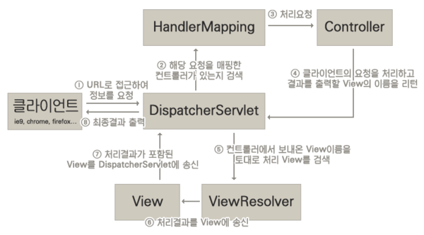

# Spring MVC

스프링은 Core라 할 수 있는 프레임워크에 여러 서브 프로젝트를 결합해서 다양한 상황에서 대처할 수 있도록 개발 되었다.

Spring MVC는 서브 프로젝트중 하나이며 서브 프로젝트란 "별도의 설정이 존재할 수 있다." 라는 개념으로서 새롭게 생성된 프로젝트일 경우 servlet-context.xml과 root-context.xml로 설정파일이 분리된 것을 확인할 수 있다. 스프링 MVC가 서브 프로젝트이므로 구성 방식이나 설정 역시 조금 다르다고 볼 수 있다.

 

# MVC 프로젝트의 로딩 구조

프로젝트 실행에 관여하는 XML파일은 web.xml, root-context.xml, servlet-context.xml 파일이다.

* web.xml = Tomcat 구동과 관련된 설정파일
* root-context.xml = 스프링 설정파일
* servlet-context.xml = 웹과 관련된 스프링 설정파일

 

### 1. web.xml 실행

 

web.xml 안에는 context-param 와 listener 태그가 존재한다.

* context-param = root-context.xml의 경로 설정
* listener = 스프링 MVC의 ContextLoaderListener 등록

 

### 2. root-context 실행

 

root-context.xml에 정의된 객체(Bean)들은 스프링 영역(Context)안에 생성되고 객체간 의존성이 처리된다.

 

### 3. web.xml 실행

 

root-context.xml이 실행된 후에는 DispatcherServlet이라는 서블릿과 관련된 설정이 동작한다. DispatcherServlet 클래스는 스프링 MVC 구조에서 가장 핵심역할을 하는 클래스이다.

내부적으로 웹 관련 처리의 준비 작업을 진행하는데 이때 사용하는 파일이 servlet-context.xml 이다.

DispatcherServlet 클래스는 XmlWebApplicationContext를 이용해서 servlet-context를 읽어 들이게 되고 servlet-context에 정의된 객체들은 스프링 영역에 생성된다.

이 과정에서 root-context에 정의된 객체들과 연동되어 의존성처리된다.

 

# Spring MVC의 기본구조 

 

-사진 출처 : http://egloos.zum.com/springmvc/v/504151

 

1. 사용자의 모든 요청(Request)는 DispatcherServlet에서 받아 처리한다.

2. DispatcherServlet에 들어온 요청을 처리하는 컨드롤러를 찾기 위해 HandlerMapping객체가 실행되며 적절한 컨트롤러를 찾았다면 HandlerAdapter를 이용해서 해당 Controller를 동작시킨다.

3. Controller는 실제 요청을 처리하는 로직을 작성하게 되며 요청에 대한 반환값을 View에 전달하게 되는데 주로 Model이라는 객체에 담아서 전달한다.
Controller는 다양한 타입의 결과를 반환하는데 이는 ViewResolver를 이용하여 처리한다.

4. ViewResolver는 Controller가 반환된 결과를 어떤 View를 통해 처리할지 해석하는 역할을 하며, 해당 view에 반환된 결과를 송신한다.

5. View는 실제로 응답 보내야 하는 데이터를 jsp 등을 이용해서 생성하는 역할을 하게 되며 요청에 대한 응답처리가 완료되면 DispatcherServlet을 통해 전송된다.

 

위와 같이 모든 요청은 DispatcherServlet을 통해 응답받도록 설계되는데 이를 Front-Controller 패턴이라고 한다. 패턴을 사용함으로인해 요청-응답 흐름을 강제로 제한할 수 있다.

흐름을 강제로 제한했기 때문에 다수의 개발자들이 협업을 하더라도 정해진 흐름을 토대로 개발하게 되고 데이터 흐름이 똑같이 개발이 되기 때문에 프로젝트 진행이 수월해진다.

 

--- 
### 참조

 

[도서] [코드로 배우는 스프링 웹 프로젝트](https://search.shopping.naver.com/book/catalog/32441631109?cat_id=50010881&frm=PBOKPRO&query=%EC%BD%94%EB%93%9C%EB%A1%9C+%EB%B0%B0%EC%9A%B0%EB%8A%94+%EC%8A%A4%ED%94%84%EB%A7%81+%EC%9B%B9+%ED%94%84%EB%A1%9C%EC%A0%9D%ED%8A%B8&NaPm=ct%3Dlgnn6to8%7Cci%3Df9134f50819e8c3c97cb52dc425aaaf51caf1073%7Ctr%3Dboknx%7Csn%3D95694%7Chk%3Dd54e09e541f31b10aad480fb36258c559ce2e5b0) 
[블로그] [http://egloos.zum.com/springmvc/v/504151](http://egloos.zum.com/springmvc/v/504151)

